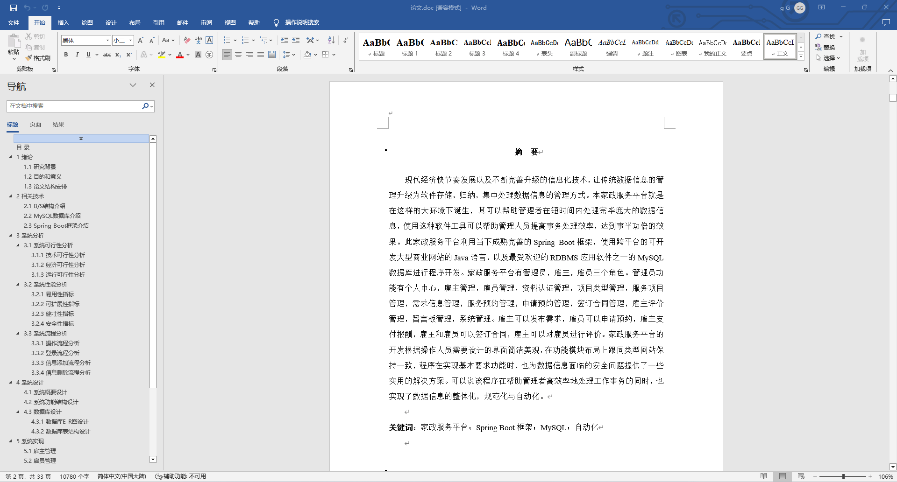
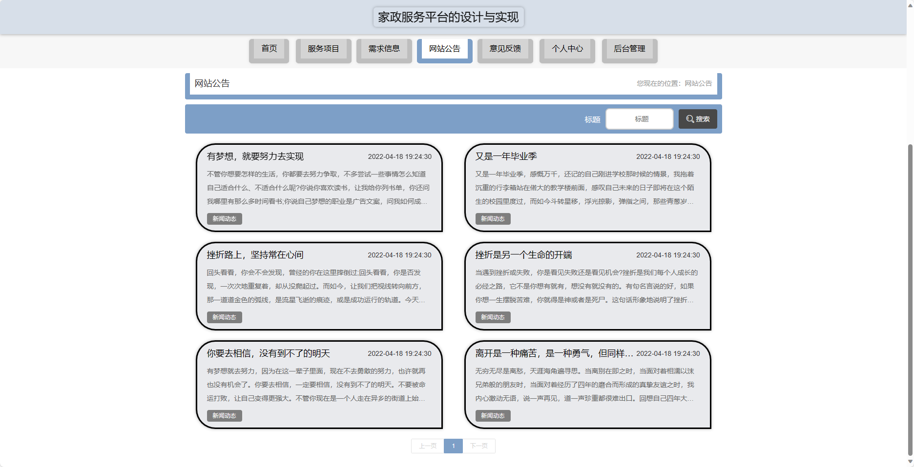
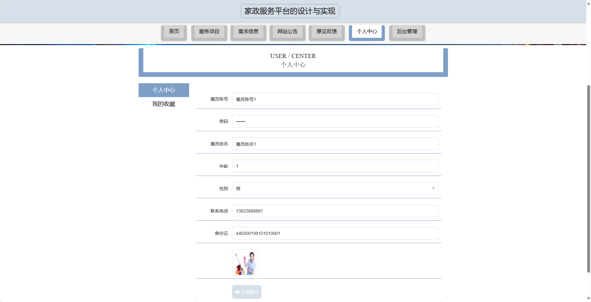
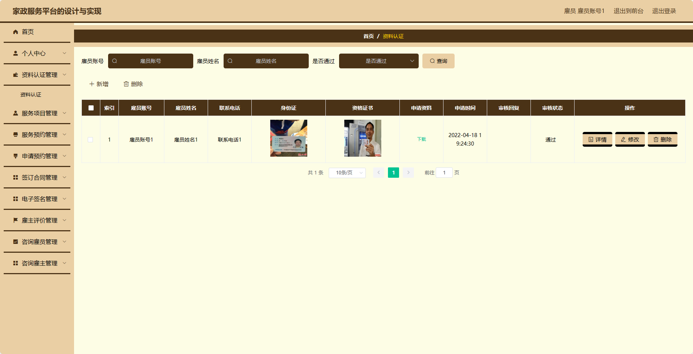
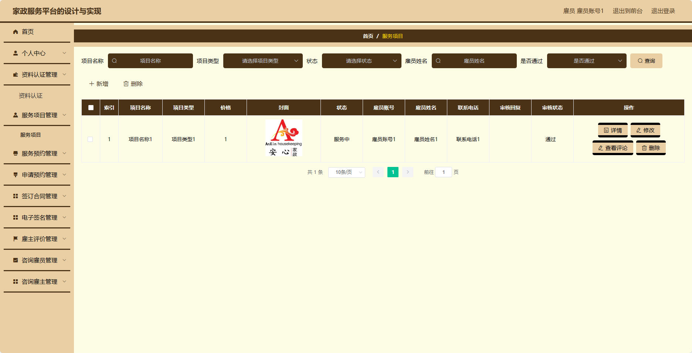
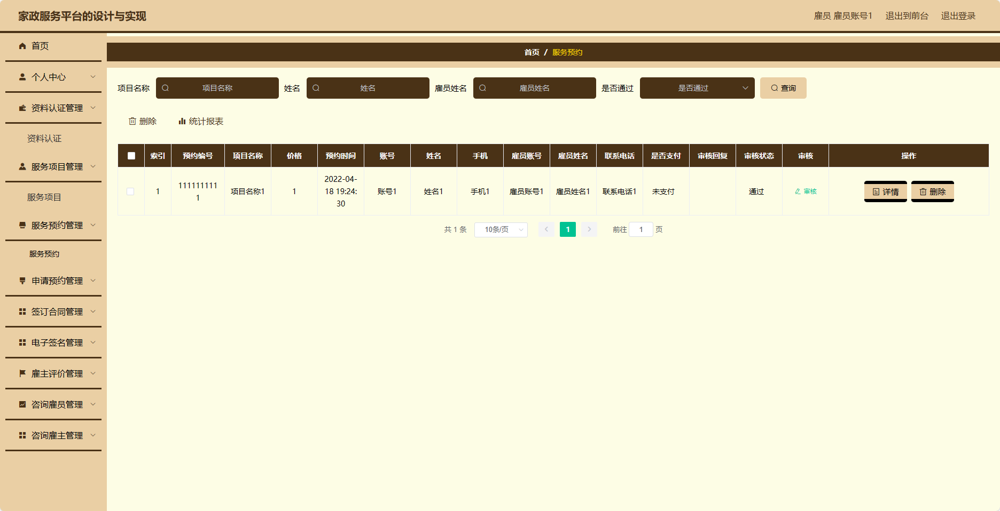
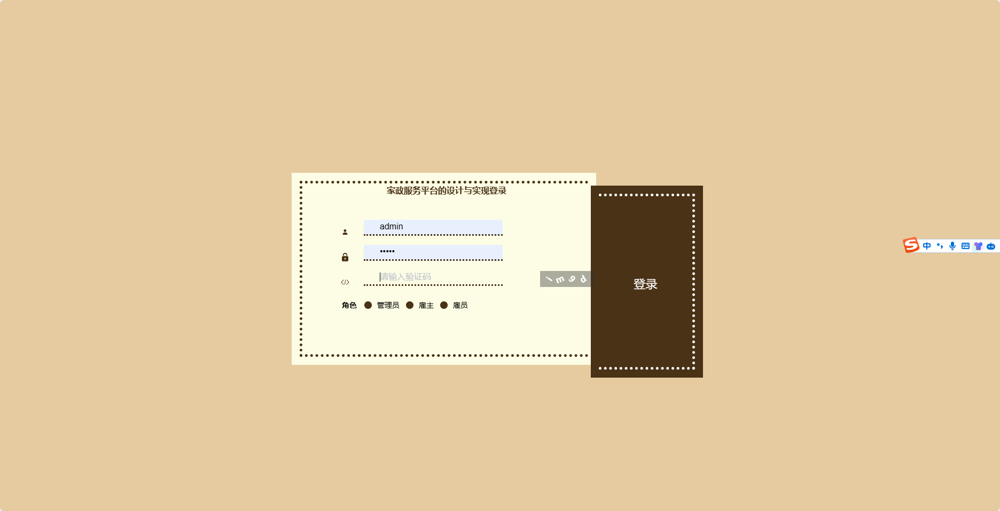

## 基于SpringBoot的家政服务平台(程序+报告)

###  获取sql数据库文件: 从戎源码网 (https://armycodes.com/) QQ: 386869957 QQ群: 377586148
###  所有系统地址: (https://github.com/YuLin-Coder/AllProjectCatalog) 
###  所有项目以及源代码本人均调试运行无问题 可支持远程安装部署调试、定制修改、代码讲解

## 项目介绍
基于SpringBoot的家政服务平台，系统包含两种角色：管理员、用户,系统分为前台和后台两大模块，主要功能如下。

### 【管理员】:
- 个人中心：管理个人信息。
- 雇主管理：管理雇主账号信息，包括添加、编辑、删除雇主等操作。
- 雇员管理：管理雇员账号信息，包括添加、编辑、删除雇员等操作。
- 资料认证管理：管理用户和雇员的身份认证信息，包括审核、驳回等操作。
- 项目类型管理：管理家政服务项目类型，包括添加、编辑、删除服务项目类型等操作。
- 服务项目管理：管理家政服务项目，包括添加、编辑、删除服务项目等操作。
- 需求信息管理：管理用户提交的需求信息，包括查看、处理、删除等操作。
- 服务预约管理：管理用户提交的服务预约信息，包括查看、处理、取消预约等操作。
- 申请预约管理：管理雇员提交的预约申请信息，包括查看、处理、驳回等操作。
- 签订合同管理：管理用户和雇员之间的合同签订及相关信息，包括查看、生成、下载合同等操作。
- 电子签名管理：管理用户和雇员之间的电子签名信息，包括查看、上传、下载等操作。
- 雇主评价管理：管理雇员的评价信息，包括查看、回复、删除评价等操作。
- 意见反馈：管理用户提交的意见反馈，包括查看、回复、删除等操作。
- 系统管理：管理整个系统的相关信息，包括修改系统设置、备份数据库等操作。

### 【用户】:
- 个人中心：管理个人信息。
- 资料认证管理：管理用户的身份认证信息，包括审核、驳回等操作。
- 服务项目管理：管理家政服务项目，包括添加、编辑、删除服务项目等操作。
- 服务预约管理：管理用户提交的服务预约信息，包括查看、处理、取消预约等操作。
- 申请预约管理：管理雇员提交的预约申请信息，包括查看、处理、驳回等操作。
- 签订合同管理：管理用户和雇员之间的合同签订及相关信息，包括查看、生成、下载合同等操作。
- 电子签名管理：管理用户和雇员之间的电子签名信息，包括查看、上传、下载等操作。
- 雇主评价管理：管理雇员的评价信息，包括查看、回复、删除评价等操作。
- 咨询雇员管理：管理用户和雇员之间的咨询信息，包括查看、回复、删除等操作。
- 咨询雇主管理：管理雇员和雇主之间的咨询信息，包括查看、回复、删除等操作

### 雇主：
- 个人中心：管理个人信息。
- 需求信息管理：发布自己的需求信息，包括添加、编辑、删除需求信息等操作。
- 服务预约管理：管理自己提交的服务预约信息，包括查看、处理、取消预约等操作。
- 申请预约管理：管理雇员提交的预约申请信息，包括查看、处理、驳回等操作。
- 签订合同管理：管理自己和雇员之间的合同签订及相关信息，包括查看、生成、下载合同等操作。
- 电子签名管理：管理自己和雇员之间的电子签名信息，包括查看、上传、下载等操作。
- 雇主评价管理：管理雇员的评价信息，包括查看、回复、删除评价等操作。
- 咨询雇员管理：管理自己和雇员之间的咨询信息，包括查看、回复、删除等操作。

### 【前台】:
- 首页：展示家政服务平台的相关内容。
- 服务项目：浏览和搜索可提供的服务项目信息。
- 需求信息：用户可以发布自己的需求信息。
- 网站公告：展示家政服务平台的公告信息。
- 意见反馈：用户可以向家政服务平台反馈意见和建议。
- 个人中心：管理个人信息，包括订单记录、个人设置等。

## 项目技术
- 编程语言：Java
- 数据库：MySQL
- 项目管理工具：Maven
- 前端技术：HTML、CSS、JavaScript、Jquery、Vue
- 后端技术：Spring、SpringMVC、MyBatis

## 运行环境
- JDK版本：JDK1.8及以上
- 开发工具：IDEA、Ecplise、Myecplise都可以
- 数据库: MySQL5.7及以上
- Maven：maven3.0及以上
- Node：14.14.0及以上

## 运行截图

